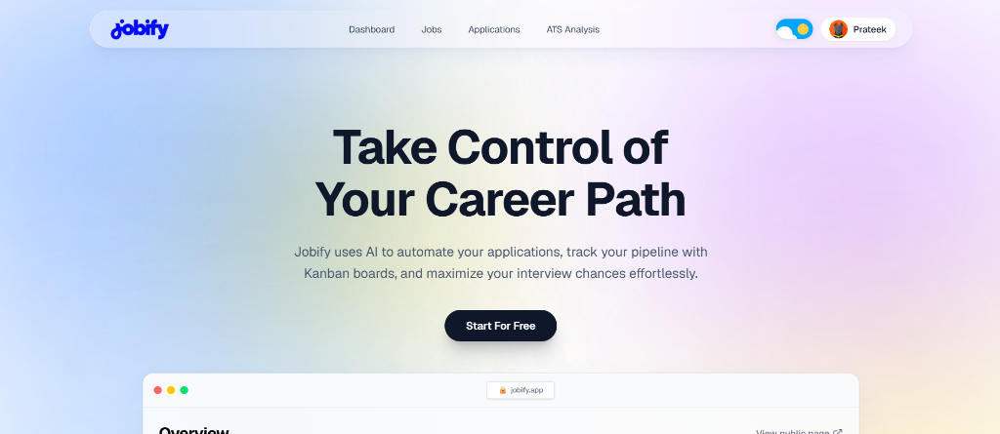
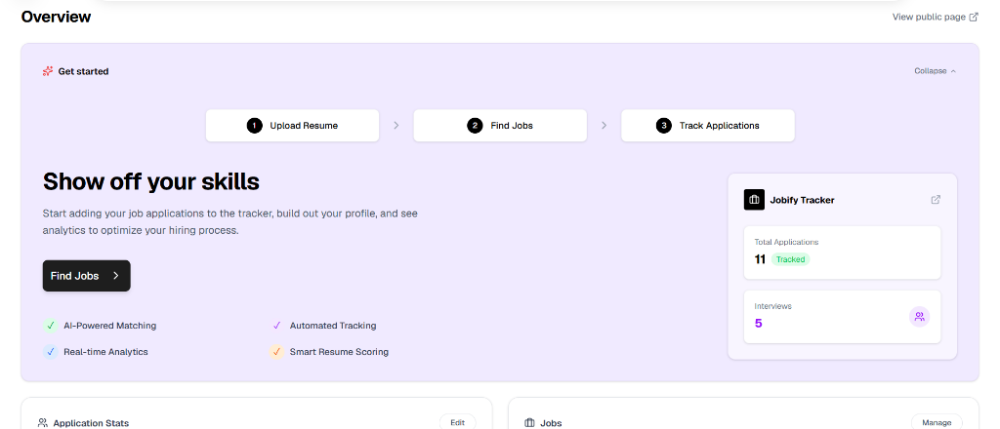
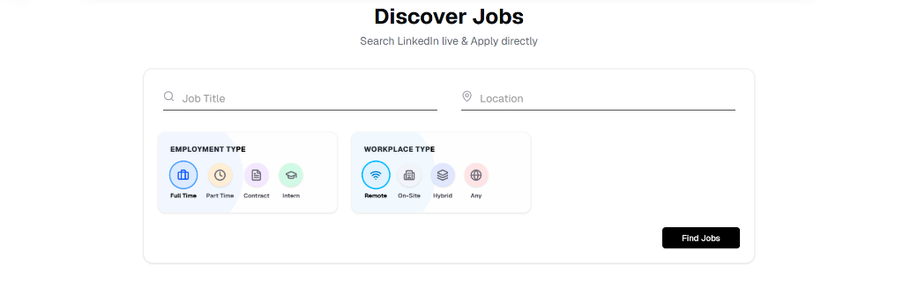
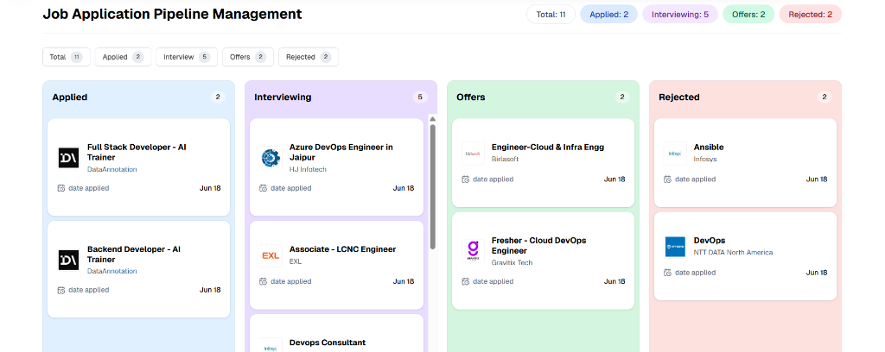

# Jobify AI - Smart Job Tracking & Resume Intelligence Dashboard

Jobify is an AI-powered developer career companion designed to automate application pipelines, analyze resumes against ATS algorithms, discover live job listings, and track progress using dynamic Kanban boards.

---

## 📸 Screenshots

### 1. Landing Page


### 2. Dashboard Overview


### 3. Live Job Discovery


### 4. Kanban Pipeline Board


---

## 🚀 Key Features

* **LeetCode-Inspired Candidate Profile**:
  * **Sidebar Profile Details**: Large avatar uploader (supports custom files & presets), social link integrations (GitHub, LinkedIn, Website, Twitter), summary edits, and technical skill tag manager.
  * **Tabbed Sidebar Navigation**: Swaps the main panel seamlessly between **Overview**, **Work Experience**, **Technical Skills**, **Projects**, and **Education**, keeping the dashboard page short and responsive.
  * **ATS Score Gauge**: Circular progress gauge showing overall match rating, missing keywords lists, and suggested improvements.
  * **Pipeline Activity Calendar**: An interactive 16-week contribution calendar mapping daily job application activities in emerald shades.
  * **Full Manual Lists Editors**: Inline add, edit, and delete forms to manage experience timeline logs, project tech tags, and degrees.
* **Smart Kanban Pipeline Board**: Drag-and-drop applications across columns (Applied, Interviewing, Offer, Rejected) with visual counts, cards, and activity logs.
* **LinkedIn Live Jobs discovery**: Query live LinkedIn jobs directly, filter by employment parameters (remote, hybrid, full-time, contract), and swipe/scroll through matching listings.
* **Theme-Agnostic Shimmering Skeletons**: Tailored router-level loading skeletons (`loading.js` components) that transition neutrally in light and dark mode.

---

## 🛠️ Technology Stack

* **Frontend**:
  * Next.js (App Router, Turbopack)
  * React 19
  * TailwindCSS
  * Framer Motion
  * Lucide Icons
  * Shadcn UI
* **Backend**:
  * Node.js & Express
  * MongoDB & Mongoose
  * PDF Resume parsing utilities
  * Gemini AI API integration

---

## ⚙️ Installation & Setup

### Prerequisites
* Node.js (v18 or higher)
* MongoDB database instance
* Gemini AI API credentials

### 1. Backend Setup
1. Navigate to the backend directory:
   ```bash
   cd backend
   ```
2. Install dependencies:
   ```bash
   npm install
   ```
3. Configure the `.env` file:
   ```env
   PORT=5000
   MONGO_URI=your-mongodb-connection-string
   GEMINI_API_KEY=your-gemini-key
   FRONTEND_URL=http://localhost:3000
   JWT_SECRET=your-jwt-secret
   ```
4. Start the backend server:
   ```bash
   npm start
   ```

### 2. Frontend Setup
1. Navigate to the frontend directory:
   ```bash
   cd ../frontend
   ```
2. Install dependencies:
   ```bash
   npm install
   ```
3. Configure the `.env.local` file:
   ```env
   NEXT_PUBLIC_API_URL=http://localhost:5000
   ```
4. Start the development server:
   ```bash
   npm run dev
   ```
5. Open [http://localhost:3000](http://localhost:3000) in your browser.

---

## 📄 License
This project is licensed under the MIT License.
